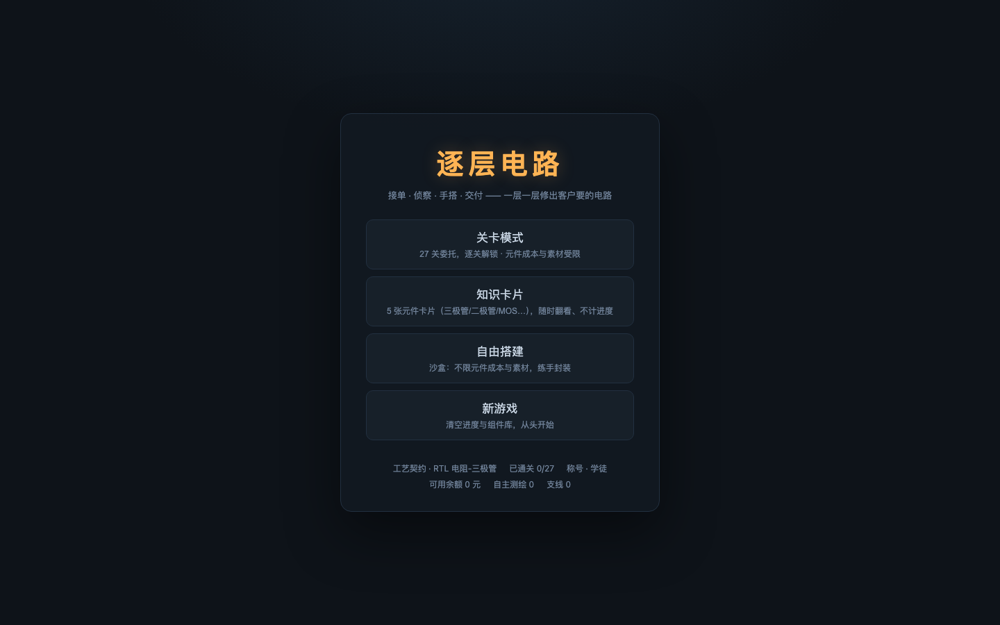

# 逐层电路：自造计算机（Layered Circuits）

**▶ 在线试玩：<https://layered-circuits.pages.dev/>** —— 打开浏览器就能玩，不用安装。进度存在你自己浏览器的 localStorage 里。

从三极管开始，逐层搭出逻辑门、触发器、加法器、寄存器，最后拼出一台**两位数加法计算器**的纯数字电路递进设计沙盒。
没有预制芯片：每一个高级模块都是你亲手搭出来、封装成积木、再在下一关复用的 —— 成本永远递归回最底层的三极管和电阻。



## 这个项目特别在哪

- **器件级真实仿真**，不是"逻辑门连线游戏"。仿真内核直接解**开关级**网表：每个三极管 / MOS / 二极管 / 电阻都参与求解，
  节点电平由**驱动强度仲裁**得出（强驱动压过弱上拉；强对强冲突判 `X`；没人驱动是 `Z`）——所以"两个输出怼在一起会怎样"
  是算出来的，不是规定出来的。时序模式下每个元件带真实传播延迟（三极管 1 ns、电阻 0.5 ns、二极管 0.8 ns），
  事件驱动队列排空的时刻就是这条电路的**关键路径**。
- **两种口径，看得见过程**：同一份电路可以按"稳定值的固定点"或"真实时序"运行。判定按关卡声明的口径取值；
  玩家可用工具栏在「稳定值看法 / 时序看法」之间切换，「时序视图」会把每个端口的跳变、竞争与毛刺画成波形 ——
  段码译码器改一个数字时输出抖 7 次，这种真实竞争冒险在这里是可见的。
- **成本递归**：一关的产出（复合模块）就是下一关的积木，成本沿引用链递归回底层元件。预算与最优解都存在内容层数据里，
  判定与界面从同一份数据派生 —— 加一关不用改判定代码。
- **四套工艺契约**：RTL 电阻-三极管 / DTL 二极管 / TTL 推挽 / CMOS 互补 MOS。选哪套，整个存档的元件集、
  输出强度规范、判定标准都跟着变（推挽契约要求输出必须是强 1，弱上拉凑出来的过不了关）。

## 快速开始

```bash
pnpm install --frozen-lockfile
pnpm dev          # 开发服务器：http://localhost:5273/
pnpm build        # 产出 apps/studio/dist（自包含 index.html + 仿真 Worker）
pnpm preview      # 本地预览构建产物
pnpm check        # 质量门：typecheck + lint + 全部测试（298 个 / 55 个测试文件）
pnpm test         # 只跑测试
```

不想装环境？`pnpm build` 之后**双击 `apps/studio/dist/index.html`** 就能离线玩（Worker 加载不了时会自动回退到主线程仿真）。

## 怎么玩

**开局**：主菜单选「新游戏」→ **选择工艺契约**（RTL / DTL / TTL / CMOS）——你选哪个逻辑族，整个存档就遵守哪个族的规范。
也可以「继续」读档；或进「**知识卡片**」认识元件（三极管 / 二极管 / 悬空与默认电平 / CMOS 结构：5 张卡片，
随时翻看、点开动手试试，**不算关卡、不计进度与成绩**）；或直接进「自由搭建」当沙盒。

**核心循环**：接单 → 搭电路 → 交付验收 → 自动封装成模块 → 下一关当积木复用 → 成本递归结算。

- **搭电路**：左侧元件/模块面板点一下 → 画布上点一下放置；点两个引脚连线；点输入符号切 0/1（Alt 循环 X/Z）；
  空白处拖动平移、滚轮缩放；`R` 旋转、`Delete` 删除、`Ctrl/Cmd+Z` 撤销；**双击连线删除、双击模块展开内部电路与成本明细**。
  门级模块显示**中文门名**（右上角小字标 IEC 符号 &、≥1、=1、1，反相门输出带气泡）；
  画布左上角预置锁定的 **VCC 电源轨**、右上角 **GND 地轨**（删不掉）：供电永远不会成为卡关原因。
- **三种看法**：**科普模式**（忽略延迟，只看逻辑结果）/ **硬核模式**（带真实延迟跑，按钮按住会看到抖动）/
  非硬核时也能按「**时序视图**」——用真实时序跑一遍并把端口波形画出来（只是看法，判定仍按关卡口径，不影响成绩）。
- **调试**：右上角「调试模式」开关——点「一键出答案」直接搭出参考电路（**默认出逻辑门版**；
  若元件版更省/更快会弹窗让你二选一并标注「造价更低 / 延迟更短」）。
- **验收**：点「交付验收」→ 右侧逐行对比输出与要求；通过后自动封装成模块并弹出**结算页**：
  客户付款 − 材料费 = 本单利润，S/A/B/C 评级，三星评价（按元件成本与传播延迟各四档，取较差）。
- **钱与称号**：钱包余额 + 通关数决定称号（学徒 → 维修铺师傅 → 高级技师 → 研究所特聘 → 总工程师）；
  可在工具铺买测试探针、示波器游标（只省操作，不替你玩）。
- **存档**：进度、钱包、组件库、榜单全部存浏览器 localStorage；「存档导出 / 导入」可整包备份（JSON）。

## 当前内容（主线 27 关 + 5 张知识卡片）

> 成本为玩家界面显示的**元**（内部记账是半单位，显示折半）。硬核时序为关键路径预算。

### 第 1 章 基础门电路（7 关）

| 关卡 | 最优成本 | 硬核时序 | 素材 |
|---|---|---|---|
| 非门 / 与门 / 或门 | 6 / 4 / 4 | 3.0 / 3.2 / 3.2 ns | 只能手搭（moduleAccess: none） |
| 与非门 / 或非门 | 10 / 10 | 5.0 / 3.0 ns | 可用组件库（教元件搭法） |
| 异或门 / 同或门 | 40 / 46 | 13.0 / 16.0 ns | 不限定元件，但教的是模块复用 |

> **知识卡片**（主菜单独立入口，与关卡模式并列）：认识三极管 / 认识二极管 / 悬空与默认电平 /
> CMOS 反相器 / CMOS 与非门 —— 元件图鉴 + 引导搭建（半成品 + 步骤引导），**不算关卡、不计进度与成绩**，
> 对上了只给一句反馈，没有结算页、没有星。CMOS 契约的新玩家，卡片内容会换成「认识 MOS / 互补对」（教什么用什么）。

### 第 2 章 时序单元（4 关）

| 关卡 | 最优成本 | 硬核时序 |
|---|---|---|
| SR 锁存器 | 20 | 关键路径 ≤8 ns |
| 按钮锁存 | 32 | 防抖锁存（按钮按住保持），≤11 ns |
| D 锁存器 | 46 | ≤14 ns |
| 主从 D 触发器 | 98 | 空翻 ≤1 次/窗口，20 MHz，关键路径 ≤13 ns |

### 第 3 章 算术与计算器（16 关）

| 关卡 | 最优成本 | 说明 |
|---|---|---|
| 半加器 / 全加器 | 60 / 90 | 异或门+与门 / 9×与非门 |
| 4位 / 8位加法器 | 360 / 720 | N×全加器串联进位 |
| 简易 ALU | 520 | 4×异或门 + 4×全加器 |
| BCD → 二进制 / 二进制 → BCD | 1080 / 3936 | 计算器的进制转换链 |
| 段码·abc / 段码·de / 段码·fg | 190 / 180 / 190 | 七段译码器按段拆开教（答案即教学内容） |
| 数码管显示 | 860 | 三段合一的完整译码器 |
| 八位寄存器 | 784 | 等号上升沿锁存 |
| 多输入或门 | 6 | 二极管或门（或门原理直接扩展，为编码器铺路） |
| 数字键盘编码器 | 44 | 10 键按钮 → 4 位码 + any（或矩阵积木） |
| 数字输入寄存器 | 874 | 8×D触发器 + 换位清除 + 写脉冲门 |
| **简易计算器** | 12382 | 编码器 + 输入寄存器 + 运算控制 + 8 位寄存器 + 2×BCD→二进制 + 7 异或 + 8 全加器 + 二进制→BCD + 显示控制 |

> 关卡数据即规格：最优成本 / 预算 / 参考解都在 `packages/content/src/levels*.ts`，判定与界面从同一份数据派生。

## 判定规则（一句话）

**功能全部符合** 就算过 —— 成本、关键路径 / 空翻 / 建立保持等性能指标只影响评分与星级
（超标仍可交付，只是低分 / 无星）；逻辑门关还要求"不是时序电路"；契约关（选 TTL / CMOS 的新游戏）
额外检查**输出强度**：推挽契约要求输出必须是强 1。

## 技术栈

| 层 | 用什么 |
|---|---|
| 前端 | React 19 + TypeScript（strict）+ Vite 7，画布是 Canvas 2D 手写编辑器（无画布框架） |
| 仿真 | `packages/sim-core`：**零 DOM 依赖**的纯 TS 内核（事件驱动 + 强度仲裁），游戏里跑在 Web Worker 上，离线求解器与测试里直接 `new Simulator(net)` |
| 数据 | Zod 校验的元件 / 网表 / 模块 / 关卡模型（`packages/schema`）+ DesignBuilder |
| 质量门 | Biome（lint + format）、Vitest（298 个测试，含判定回归与内容自检护栏）、`pnpm check` 一把跑全 |
| 部署 | 纯静态（无后端、无数据库）：Cloudflare Pages，见 `DEPLOY.md` |

## 目录结构

```
apps/studio/     # 游戏本体（React + Canvas 画布 + Web Worker 仿真通道）
packages/
  schema/        # 数据模型：元件/网表/模块/关卡（Zod 校验）+ DesignBuilder
  sim-core/      # ★纯 TS 仿真内核：开关级求值 + 事件驱动调度（零 DOM）
  compiler/      # ★编译与判定：Design→网表；成本；模块封装/内容哈希；时序；judgeDesign
  content/       # 关卡数据 + 参考解 + 门版教学积木 + 委托文案
docs/            # GDD / Tech-Plan / sim-semantics / architecture / 关卡设计规范 / images
tools/
  opt-solver/    # 离线最优解求解器（预算的源头）
  level-editor/  # spec → 已验收关卡（30 分钟产出一关）
```

## 一段代码看懂内核

```ts
import { NetlistBuilder, Simulator } from '@lc/sim-core';

const b = new NetlistBuilder();
const IN = b.node('IN'), VCC = b.node('VCC'), GND = b.node('GND');
const B1 = b.node('B1'), A = b.node('A'), OUT = b.node('OUT');
b.power(VCC, 1); b.power(GND, 0);
b.res(IN, B1, 'R1');      // 输入限流
b.npn(A, B1, GND, 'Q1');  // 共射反相级
b.res(VCC, A, 'R2');      // 上拉
b.npn(VCC, A, OUT, 'Q2'); // 射极跟随器输出级
b.res(OUT, GND, 'R3');    // 输出下拉
b.input(IN, 'in'); b.output(OUT, 'out');
const net = b.build();    // 2 三极管 + 3 电阻 = 成本 7

const sim = new Simulator(net, { mode: 'logic' });
sim.setInput('in', 1);
console.log(sim.readPort('out')); // 0
```

## 文档

- **`docs/README.md`** —— 开发者接手文档（架构、核心概念、新增一关的流程、已知待办与坑）
- **`docs/sim-semantics.md`** —— 仿真语义权威定义（强度、冲突、时序口径、稳定判据）
- `docs/architecture.md` —— 分层与模块边界
- `docs/《逐层电路：自造计算机》游戏设计文档（GDD）.md` —— 玩法与关卡设计
- `docs/技术方案与开发路线（Tech-Plan）.md` —— 技术决策与路线
- `docs/关卡设计规范（规模与积木复用）.md` —— 关卡规模与复用规范
- **`DEPLOY.md`** —— 部署到 Cloudflare Pages / EdgeOne，以及"发一个文件就能玩"的分享方式

## 许可

许可证待定 —— 补上 `LICENSE` 后此节会同步更新。